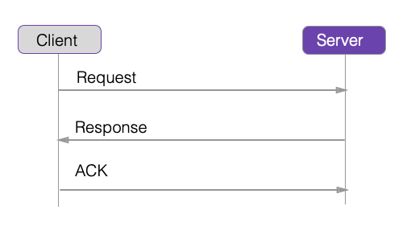

theme: Fira, 3

<br>
# the promised land


Tomasz Gebarowski
@tgebarowski

--- 

## why __async code__ still needs some __rework__ in future *Swift* versions?

--- 

### Typical scenario



---

### the chaining hell 👿

[.code-highlight: 5-14]

```swift
class ServiceA {
    func send(completion: (Model) -> Void, error: (Error) -> Void) { /* TODO */ }
    func ack(model: Model, completion: () -> Void, error: (Error) -> Void) { /* TODO */}

    func trigger() {
        send(completion: { [weak self] (model) in
            self?.ack(model: model, completion: {
                /*TODO*/
            }, error: { (error) in
                /*TODO Error handling 🙄 */
            })
        }) { (error) in
            /*TODO Error handling 🙄 */
        }
    }
}
```

--- 


### Result doesn't make it better

[.code-highlight: 5-20]

```swift

class ServiceB {
    func send(completion: (Result<Model>) -> Void) {/* Implement me */}
    func ack(model: Model, completion: (Result<Model>) -> Void) {/* Implement me */}

    func trigger() {
        send { [weak self] (result) in
            switch result {
            case .success(let value):
                self?.ack(model: value, completion: { (result) in
                    switch result {
                    case .success(_): return /*TODO */
                    case .failure(_): return /*TODO error handling 🤫 */
                    }
                })
            case .failure(_):
                /* TODO Error handling */
                return
            }
        }
    }
}


```

---

### ok we can refactor...

[.build-lists: true]

[.code-highlight: 1-11]
[.code-highlight: 12-20]

```swift

    func trigger() {
        send { [weak self] (result) in
            switch result {
            case .success(let value):
                self?.handleAck(model: value)
            case .failure(_):
                /* TODO Error handling */
                return
            }
        }
    }

    private func handleAck(model: Model) {
        ack(model: model, completion: { (result) in
            switch result {
            case .success(_): return /*TODO */
            case .failure(_): return /*TODO error handling 🤫 */
            }
        })
    }

```
---

### why not using sth battle tested in other languages?

[.build-lists: true]

[.code-highlight: 2-12]
[.code-highlight: 13-21]

```swift

class ServiceD {

    func send() -> Promise<Model> {
        /* Implement me */
        return Promise(value: Model())
    }

    func ack(model: Model) -> Promise<Void> {
        /* Implement me */
        return Promise()
    }

    func trigger() {
        send().then { [weak self] (model) in
            return self?.ack(model: model)
        }.then { (_) in
            /*TODO Implement success */
        }.catch { (error) in
            /* TODO Implement error handling 🤫 */
        }
    }
}

``` 

---

#Promises

- __Shorter__ syntax 
- Neat __chaining__
- Single place for __error handling__
- Easier transition towards __awake/async__

---

# What else could go wrong?
[.build-lists: true]
[.code-highlight: all]
[.code-highlight: 2, 4, 6, 7]


```swift

    func download() {
        showActivityIndicator()
        send(completion: { [weak self] (model) in
            self?.hideActivityIndicator()
        }) { [weak self] (error) in
            self?.hideActivityIndicator()
            self?.handle(error: error)
        }
    }
```

---

#Even with promises it doesn't look nice

```swift

    func download() {
        showActivityIndicator()
        send().then { [weak self] (model) in
            self?.hideActivityIndicator()
        }.catch { [weak self] (error) in
            self?.hideActivityIndicator()
            self?.handle(error: error)
        }
    }
```

---

## Can we avoid this clutter?

---

```swift

protocol RequestBehaviour {
    func beforeSend()
    func afterSuccess(result: Any)
    func afterFailure(error: Error)
}

```

---

```swift

class Repository {
    private let behaviour: RequestBehaviour
    private let session: URLSession

    init(behaviour: RequestBehaviour, session: URLSession = URLSession.shared) {
        self.behaviour = behaviour
        self.session = session
    }
    ...
}
```

---

```swift

class Repository {
    ...
    func get<T: Decodable>(url: URL) -> Promise<T> {
        return Promise<T>(work: { [weak self] (fulfill, reject) in
            self?.behaviour.beforeSend()
            self?.session.dataTask(with: url) { [weak self] (data, response, error) in
                if let theData = data,
                    let model = try? T.init(inputJSON: theData) {
                    self?.behaviour.afterSuccess(result: model)
                    fulfill(model)
                } else {
                    self?.behaviour.afterFailure(error: theError)
                    reject(theError)
                }
            }.resume()
        })
    }
}
```

---

# Combined Behaviours

```swift

struct CombinedRequestBehavior: RequestBehaviour {

    let behaviours: [RequestBehaviour]

    func beforeSend() {
        behaviours.forEach({ $0.beforeSend() })
    }

    func afterSuccess(result: Any) {
        behaviours.forEach({ $0.afterSuccess(result: result) })
    }

    func afterFailure(error: Error) {
        behaviours.forEach({ $0.afterFailure(error: error) })
    }
}

```

---

# Activity Indicator Request Behaviour

```swift
class ActivityIndicatorRequestBehaviour: RequestBehaviour {
    ...

    init(activityIndicatorProvider: ActivityIndicatorProviding) {
        self.activityIndicatorProvider = activityIndicatorProvider
    }

    func beforeSend() { activityIndicatorProvider.showProgress() }

    func afterSuccess(result: Any) { activityIndicatorProvider.hideProgress() }

    func afterFailure(error: Error) { activityIndicatorProvider.show(error: error) }
}
```
---

## How to provide Activity Indicator?

---

A common pattern is to create a *BaseViewController* class, having common functionality shared between all view controllers and include our Activity Indicator there. 🤔


---

This *BaseViewControllers* tend to grow. If they are large enough it is very probable that subclasses will not only a small subset of the functionality of the parent. 

---

We could do better with Child View Controllers  💪

---

Let's start with some helper extension

```swift

extension UIViewController {
    func addBehaviour(viewController: UIViewController) {
        addChild(viewController)
        viewController.view.alpha = 0
        view.addExpanded(subview: viewController.view)
        viewController.didMove(toParent: self)
    }

    func dispatch<T: UIViewController>(closure: (T) -> Void) {
        guard let callee: T = behaviour() else { return }
        closure(callee)
    }

    private func behaviour<T: UIViewController>() -> T? {
        return children.first(where: { $0 is T}) as? T
    }
}
```

---

Implement Activity Indicator logic inChild View Controller

```swift
final class ActivityIndicatorBehaviour: UIViewController, ActivityIndicatorProviding {

    let application = UIApplication.shared

    func showProgressHud() {
        application.isNetworkActivityIndicatorVisible = true
    }

    func hideProgressHud() {
        application.isNetworkActivityIndicatorVisible = false
    }

    func show(error: Error) {
        hideProgressHud()
        showAlertController(error: error)
    }
}
```

---

```swift
protocol ActivityIndicatorProviding {
    func registerActivityIndicatorProvider()
    func showProgress()
    func hideProgress()
    func show(error: Error)
}

extension ActivityIndicatorProviding where Self: UIViewController {

    func registerActivityIndicatorProvider() {
        addBehaviour(viewController: ActivityIndicatorBehaviour())
    }

    func showProgress() {
        dispatch { (behaviour: ActivityIndicatorBehaviour) in
            behaviour.showProgressHud()
        }
    }
    ...
}
```

---

Provide a thin "base" class

```swift

class ViewController: UIViewController {

    override func viewDidLoad() {
        super.viewDidLoad()
        (self as? ActivityIndicatorProviding)?.registerActivityIndicatorProvider()
    }
}
```

Enable Activity Indicator in your custom VC

```swift
class CustomViewController: ViewController {}

extension CustomViewController: ActivityIndicatorProviding {}

```


---

# Where to go from now?:)

http://github.com/tgebarowski/thepromisedland

---

#References

- __Request Behaviours__:
*http://khanlou.com/2017/01/request-behaviors/*
- __Many View Controllers__:
*http://khanlou.com/2016/02/many-controllers/*
- __Promises__
*https://github.com/khanlou/Promise*

---

## Thank You 😅

